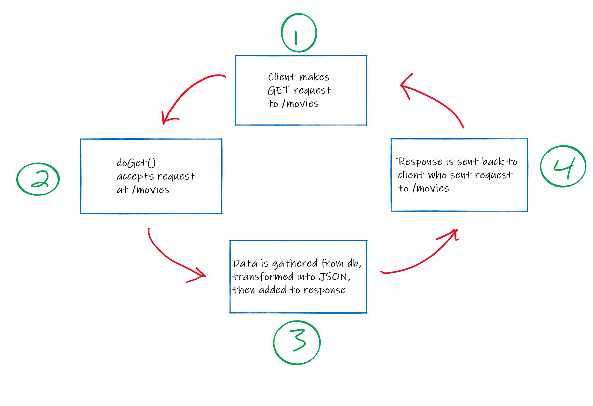

# Controllers

The word "controller" has a few definitions in software development. For a Spring Boot application, a controller is the component that:
1. receives a request from a requestor (often an end-user's frontend browser application)
2. calls on other classes to authenticate and/or authorize the request, if necessary
3. calls on other classes to fulfull the request
4. packages up an sends the response (successful or not) to the requestor

Thus, a Spring Boot controller is like a manager for the RESTful web services being requested. It is in charge of fulfilling the request, but is not supposed to handle the details directly. It instead delegates out the detailed work to other classes.



At a high level, most internet communication consists of requests and responses. It follows a very common pattern:
- A client (perhaps an application running in your browser) makes
a request to an endpoint on a URL
  - `GET --> myMoviesApp.com/movies`
- The server, listening for `GET` requests at `/movies` sends a response (JSON, plain text,
even entire files!)
- The waiting client receives the response, parses the data within, and takes some action

It is important to understand that all of our Java code will reside
*server-side* (as opposed to *client-side*, which is where our JavaScript runs). This means that a user visiting our
website will not know that our server is running Java, just that when they ask for movies they get movies!

In effect, we can use a Java application to create our *own* API! Luckily, a lot of the tedium of managing the request, like parsing the request and packaging the response will be handled by the Spring Boot framework. As with other good frameworks, the result is speeding up your development time.


---

## Our First Controller

The first step in building our application will be to define a *controller* and define what routes the controller responds to. Luckily, Spring gives us a very easy way to do this. Create a Java class in the `web` package called `HelloController`. The following code defines a controller that responds to
requests for `/hello`:

```java
@Controller
public class HelloController {

    @GetMapping("/hello")
    @ResponseBody
    public String hello() {
        return "Hello from Spring!";
    }
}
```

Notice the fairly heavy use of annotations. Spring can be configured in a number of ways, and one of the easiest and most modern ways to do this is with annotations. We will be using annotations fairly extensively to configure our application, as opposed to the more traditional (and verbose) approach of
XML-based configuration.

Lets take a look at the annotations above in more detail.

- `@Controller`: defines that our class is a controller
- `@GetMapping`: defines a method that should be invoked when a GET request is
  received for the specified URI
- `@ResponseBody`: tells Spring that whatever is returned from this method
  should be the body of our response

---
### `@PathVariable`

Spring allows us to use *path variables*, that is, dynamic additions to the path of a request. 

Here is an example of a method which uses a path variable:

```java
@GetMapping("/hello/{name}")
@ResponseBody
public String sayHello(@PathVariable String name) {
    return "Hello, " + name + "!";
}
```

By adding `@PathVariable` in front of the `String name` parameter, we let Spring know that the *value* of `{name}` (our actual path variable) from `@GetMapping("/hello/{name}")` 
should be mapped to our annotated method parameter.

I.e., a request to `/hello/Laura` would result in sayHello() returning:

```JAVA
"Hello, Laura!"
```

`{name}` is *variable* because it can change. We can make a request to `/hello/Laura` or `/hello/Bob`. Our `sayHello()` method will treat both names the same!

---
Notice that we can also use annotations in the definition of method parameters.

If the path variable we are looking for is not a string, we can simply define the parameter with a different type.

For example, an `int`:

```java
@GetMapping("/increment/{number}")
@ResponseBody
public String addOne(@PathVariable int number) {
    return number + " plus one is " + (number + 1) + "!";
}
```

Making a request to `/increment/10` would result in `addOne()` returning:

```JAVA
  "10 plus one is 11!"
```

---
## Further Reading

- [Web MVC Framework](http://docs.spring.io/spring/docs/4.3.5.RELEASE/spring-framework-reference/htmlsingle/#mvc)
- [URI Template Patterns](http://docs.spring.io/spring/docs/current/spring-framework-reference/html/mvc.html#mvc-ann-requestmapping-uri-templates)
- [RequestMapping javadoc](https://docs.spring.io/spring-framework/docs/current/javadoc-api/org/springframework/web/bind/annotation/RequestMapping.html)


## Next Up: [Views](4-views.md)
