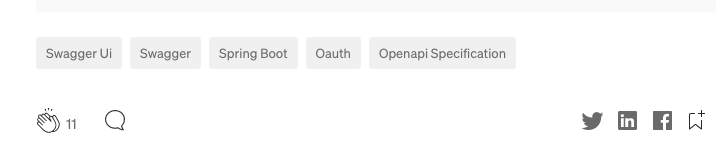

# Building Relationships, Pt II

Now that we've bound Users and Posts together as a ***one-to-many*** relationship, let's think about binding our objects together in a ***many-to-many***
relationship within our application.

---
### The following are user stories to be implemented in your blog application

## US9: As a user, I can view categories assigned to a post

## US10: As a user, I can assign categories to a post

## [OPTIONAL] US11: As a user, I can search for posts by category.

---

## Categories

In many blogging sites, you will see a post with an accompanying set of ***categories***, ***hashtags***, or something similar.

This is indicating from under which categories a blog post can be found.

Implementing this functionality is actually very simple!

---
## US9-A, US10-A: Create the `Category` class

We will create an object which will represent a single category.

Its job is to provide the names of which categories *exist*.

1. In the `data` package, create the `Category` class.

2. Let's give it only two private fields:
    - Long id
    - String name

3. As usual, we need to create our POJO components for this class.

---

## US9-B, US10-B: Create Many-to-Many Relationship between Posts and Categories

It's time to bind our `Post` and `Category` objects together, but first we need to think about the relationship between
the two.

**Unlike Users and Posts, this is going to need to be a ***many-to-many*** relationship**:

- One `Category` can be related to many Posts.
    - The `javascript` category could have hundreds of posts associated.
    

- One `Post` could have many Categories
    - A single post can be filed under `javascript, DOM, and web design`
    

Thinking about this and how we implemented the Users-Posts relationship, try to add the needed fields to `Post` and `Category`. As well, add the getters/setters

***Keep in mind that the relationship is slightly different!***

---

## US9-C, US10-C: Create the `CategoriesController`

Now that we have this relationship established, let's expose endpoints to provide the functionality to our client.

1. In the `web` package, create a `CategoriesController`
    - This REST Controller will accept `application/json` and listen on `/api/categories`

2. In `CategoriesController`, add a new private method: `getPostsByCategory()`
    - Annotate with `@GetMapping` to designate the request method.

3. `getPostsByCategory()` will return a `Category`. 
    - Within that category is a list of `Post` objects which will have the related `Category`
    - Some `Post` objects *could* have more than one `Category` nested within them. How could we use this in our client-side to provide a more unique experience? 

4. It will accept a parameter: `@RequestParam String categoryName`

    
5. As we have done previously, let's just create hard-coded objects to return.
    - You'll want to create a `Category` object and nest a few `Post` objects within the `posts` field.
    - Be sure to set each post's categories to null (i.e., `post.setCategories(null)`). Otherwise, you may end up with **INFINITE RECURSION** in your response
    - TEST with Swagger or Postman!!!
    
---

### Implement these tasks:

## US9-D: Show categories of blog posts on the client-side

## US10-D: Enable assignment of categories on the client-side

## *¡Feel free to style up your frontend!*

---

## Next Up: [Data Persistence](../iii-data-persistence/12-data-persistence.md)

