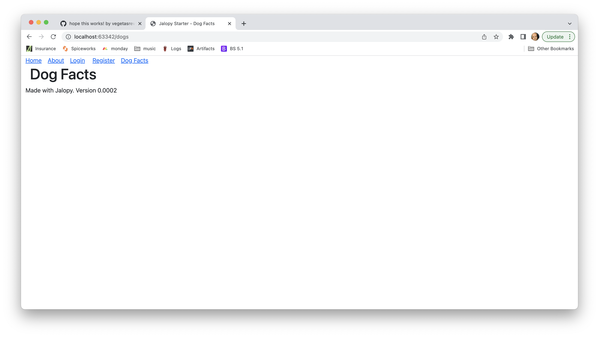

# Adding a Screen to a Jalopy Application

In this lesson, we will a new screen/view component to our Jalopy project. The process is similar to modifying an existing screen. But in addition to modifying a few of the existing fileds, we will create a brand new file: the view component for the new screen. Generally, the steps are:

1. make the new view file in the `./views` directory, giving the view component an HTML function and a JavaScript function. These functions should just be placeholder functions for this step, with minimal, or no content.
2. add a routing entry for the new screen in `router.js`
3. add one or more navigation links in existing screens
4. try out your new screen
5. go back to thew view component and add content/functionality to the screen

## Step 1: make the new view component file
Let's add a new page that will display a single fact about dogs.

Create a new file: `views/DogFacts.js` with the following code:
```js
export default function DogFactsView(props) {
    return `<h1>Dog Facts</h1>`;
}

export function DogFactsEvents() {
}
```
`DogFactsView(props)` is the HTML function for the screen and `DogFactsEvents()` is the JavaScript function. We have to `export` both functions so that the framework can call them when the user navigates to the screen. `props` is a parameter containing any data that needs to be passed to the HTML function (more about this next lesson).

## Step 2: add a routing entry
Open the file `router.js` and add the following line to the end of the `imports` at the top of the file:
```js
import DogFactsView, {DogFactsEvents} from "./views/DogFacts.js";
```
This line of code imports the HTML and JavaScript functions from the view component. Next, add a routing entry for the Dog Facts screen. 
```js
        '/dogs': {
            returnView: DogFactsView,
            state: {},
            uri: '/dogs',
            title: 'Dog Facts',
            viewEvent: DogFactsEvents
        },
```
`'/dogs'` is the route that will navigate the application to the Dog Facts screen. `returnView` tells the framework which function will be called to generate the HTML part of the screen. We will discuss `state` in the next lesson. `uri` should match the route. `title` is what you want to display on the browser title bar when the screen is loaded. `viewEvent` tells the framework which function will be called after the screens DOM is loaded. This function is normally used to initialize screen fields and add event listeners to DOM elements.

## Step 3: add navigation links
There are different ways to cause navigation to the new screen: a link in the menu, a link in page content, redirection, etc. Navigation specifics depend on the application and its developers. We will extend the starter Jalopy menu with a link for the new screen.

Open the file `views/partials/Navbar.js. Replace the last three lines of the file with this:
```js
    html += `<a class="jalopy-nav" href="/dogs" data-link>Dog Facts</a>`;
    html += `</nav>`;
    return html;
}
```
This code adds a link to the end of the menu that will route to the Dog Facts screen.

## Step 4: try it out
Run your application in the browser and view your handiwork! It should look something like this:



## Step 5: add more content to the view component

Finally, let's jazz up the Dog Facts screen by displaying a dog fact from https://dog-api.kinduff.com/api/facts?number=5

Replace your `DogFactsView` function with this:
```js
export default function DogFactsView(props) {
    return `
<div class="container">
    <h1>Dog Facts</h1>
    <div class="card">
        <div class="card-body">
            <p class="dog-fact">Humans generally see better than dogs, but dogs see much better when there is low-light.</p>
        </div>
    </div>
</div>
`;
}
```

Check out your work!

## Adding some JavaScript

Lastly, let's hide the fact and add a button. When the button is clicked, the fact will show itself. For convenience and brevity, we will use inline CSS to hide the fact. Here's the code for the entire `views/DogFacts.js`:

```js
export default function DogFactsView(props) {
    return `
<div class="container">
    <h1>Dog Facts</h1>
    <div class="card">
        <div class="card-body">
            <p class="dog-fact" style="visibility: hidden">Humans generally see better than dogs, but dogs see much better when there is low-light.</p>
        </div>
    </div>
    <button class="form-control" id="show-fact-btn">Show Fact</button>
</div>
`;
}

export function DogFactsEvents() {
    const btn = document.querySelector("#show-fact-btn");
    btn.addEventListener("click", function(event) {
        const facts = document.querySelectorAll(".dog-fact");
        for (let i = 0; i < facts.length; i++) {
            facts[i].style.visibility = "";
        }
    });
}
```

## Exercise

Let's add a Quotes screen, where we will display quotes from famous people.

1. create a new view component file called `views/Quotes.js`
2. in `Quotes.js`, create an HTML function called `QuotesView` and a JS function called `QuotesEvents`. Remember to `export` both functions.
3. add an entry in `router.js`. Remember to `import` both functions.
4. in the `QuotesView` function, add an empty `<div>` or `<table>` in which you will use JS to add quotes. Give it an id of `my-quotes`
5. in the `QuotesEvents` function, use JavaScript to dynamically add ALL of the below quotes to your `my-quotes` element (`div` or `table`). Format your quotes however you wish (e.g., striped table rows, Bootstrap cards, etc.). Encapsulate all of the functionality for adding a single quote to `my-quotes` in its own function called `addQuote`. This function can call other functions, if you wish.


### Sample Quote Data

Quote: "War is organized murder and torture against our brothers."
Author: "Alfred Adler"

Quote: "Follow sound business trends, not fashion trends."
Author: "Janice Dickinson"

Quote: "I'm sure we, the American people, are the butt of jokes by those in power."
Author: "Alice Walker"

Quote: "If the security forces continue to be dominated as they are now by political groups or sects, then the people won't trust in them - and the result will be civil war or fragmentation of the country."
Author: "Adnan Pachachi"

Quote: "We prefer world law in the age of self-determination to world war in the age of mass extermination."
Author: "John F. Kennedy"

Quote: "I got a lovely check today from being a writer that I earned by sitting at home. That's rewarding."
Author: "Harvey Fierstein"

Quote: "I think God's justice is making wrongs right."
Author: "Joel Osteen"

Quote: "For it is mutual trust, even more than mutual interest that holds human associations together. Our friends seldom profit us but they make us feel safe. Marriage is a scheme to accomplish exactly that same end."
Author: "H. L. Mencken"

Quote: "If science fiction is the mythology of modern technology, then its myth is tragic."
Author: "Ursula K. Le Guin"

Quote: "Men, when they fight in movies, it's a very different style. Harrison Ford was so cool when he had the whip, and Bruce Lee was such an artist that you couldn't take your eyes off of him."
Quthor: "Lucy Liu"

## Next Lesson

[Adding API Calls](add_api.md)